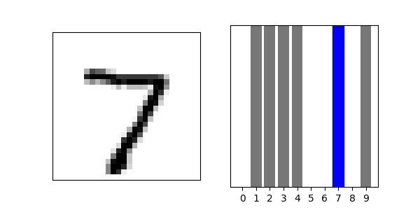

\* Please excuse the messy code and repo, my personal computer was not exactly setup for doing work and I didn't want to take too much time. My experience with NNs is mostly in time-series modeling but that was not an option given in the prompt.

# Pre-Trained Model
The purpose of the model is to classify images of hand-drawn numbers, 0-9, as the correct corresponding number. The image below shows an example of using the pre-trained tfgan model. With an example of a test image on the left and the blue bar indicating the predicted value with the highest confidence.

I wasn't able to get pydot and graphviz to work on my personal computer, therefore not able to print the model architecture with model_plot().

The sparse categorical cross-entropy loss was 4.7 and the accuracy was 98%.

# Customer Built Model
The model architect: 
* tf.keras.layers.Flatten(input_shape=(28, 28)),
* tf.keras.layers.Dense(128, activation='relu'),
* tf.keras.layers.Dense(10)

The sparse categorical cross-entropy loss was 0.08 and the accuracy was 97%.

First, In a non-test setting, I would review relevant documentation from others who have solved similar problems in order to get an idea on the best performing architecture and activation function. Comparing the results of the pre-trained vs. custom model, we can see that the PT has a slightly higher accuracy but much higher loss. This indicates to me that there are certain images that are much more difficult to predict than others. Although there is not a direct correlation because the model architecture is different, a simple observation can be made that improving accuracy by one point has a multiplicative effect on loss. If we imagine a spectrum between underfit and overfit, both models are towards the middle but on opposite sides. Since, there is indication of the custom model being slightly underfit I would first start my tuning with that in mind. Typically, this would involve adding units to each layer or adding more layers. For me, it is less time-consuming to start by choosing a number of units per layer and number of layers that I assume will make the model overfit then backing down to fit. This is because there are two types of levers going from overfit to fit as opposed to underfit to fit. Both have the process of adding/subtracting units and layers, but when going from overfit to fit regularization and dropout layers can also be used. The overall process is based in directional experimentation, change something and see how the performance metrics react, based on the magnitude and direction of the change, choose the next experiment.        
